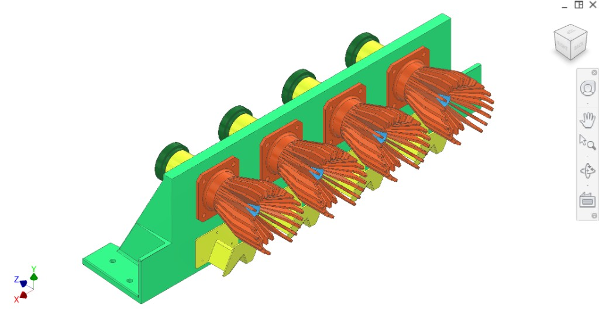
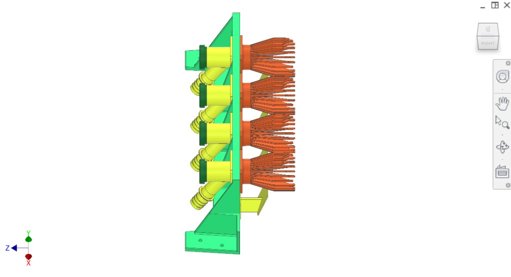
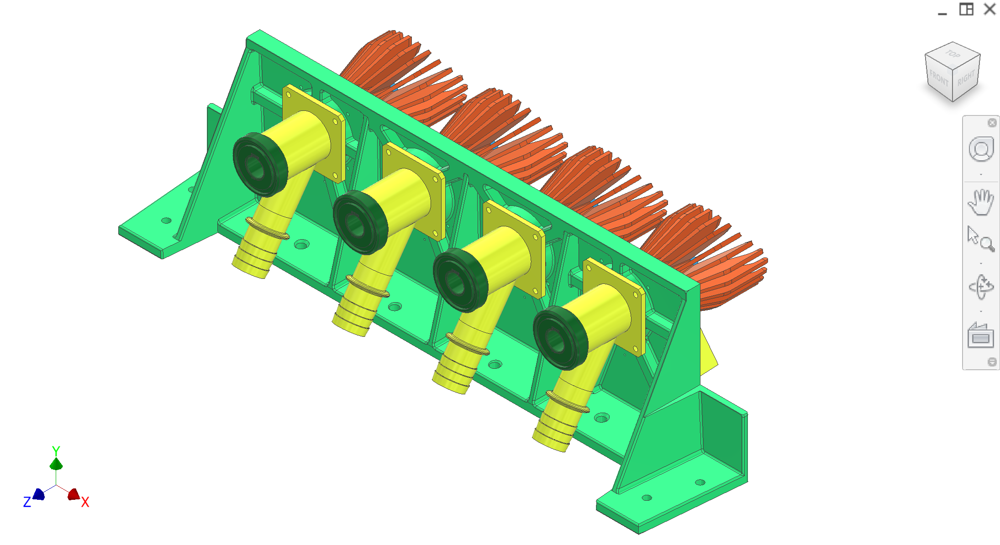
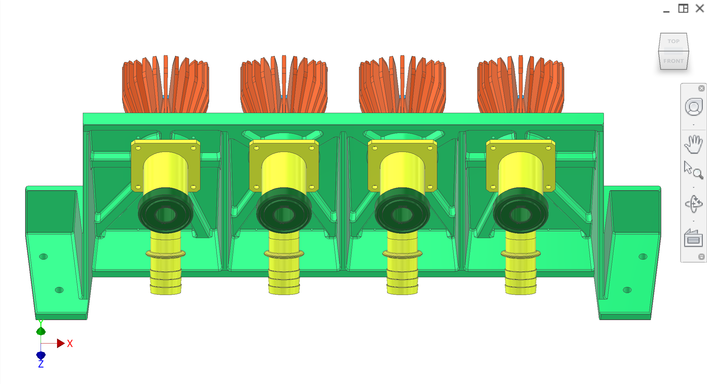
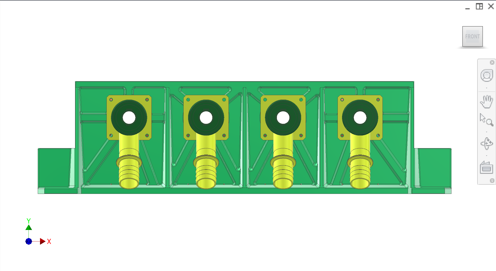
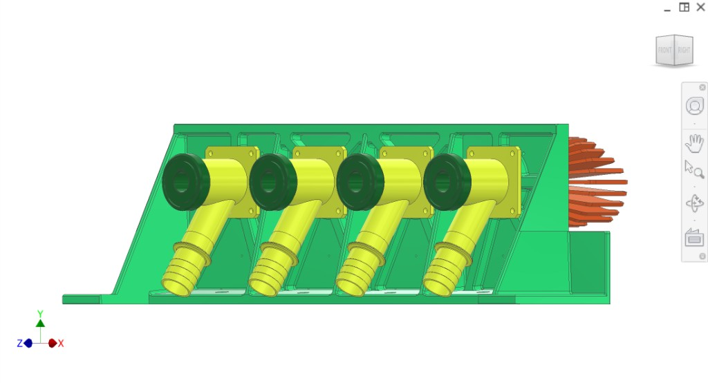
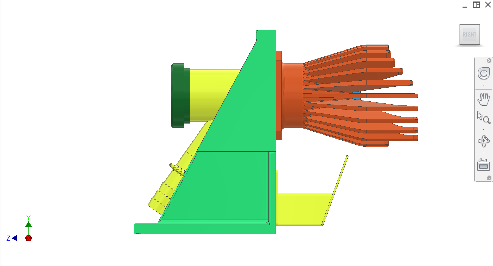
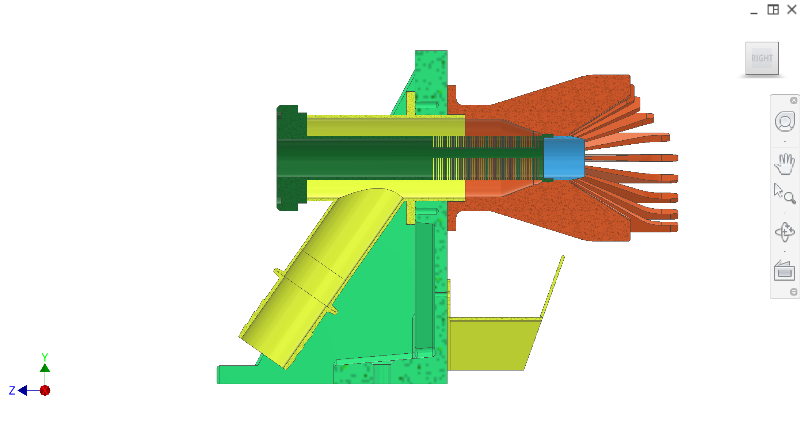
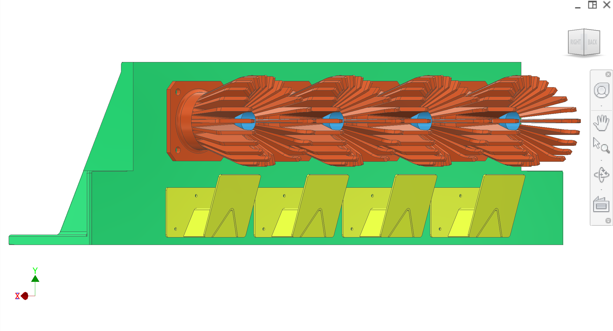
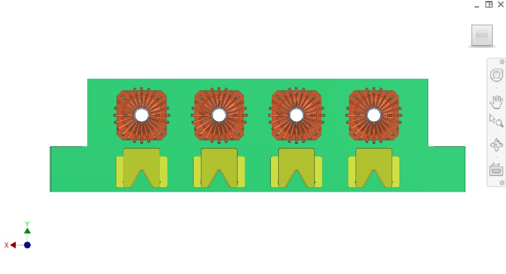

# Collection subsystem

The **collection subsystem** mounts on the **collection mount plate** (loaded mount plate on the main frame). It consists of **static peelers** (#F36F3B), **juice collectors** (yellow Y-tubes #FFFF50), **filter tube** (dark green #287F3F), **plug cutter** (light blue #4DB7F5), and the **collection mount plate** (bright green #27C16A).

## Function

- **Driven peelers** and **static peelers** together are what oranges fall between; they mesh to juice the fruit.
- When the two mesh, the **fingers** on the static peelers and the fingers on the driven peelers **interlace**. The **peel** of the fruit is **squeezed out** between the fingers into the **extraction chamber** surrounding it and into the **outflow chute**. **Static deflectors are removed**; core-chute coverage during compression is handled by the **driven chute deflector** under the driven peeler modules (Extraction & synchronisation).
- During the juicing action, when the orange is mashed between the peelers, the **plug cutter** cuts a **cylindrical plug** out of the centre of the oranges.
- **Juice** flows out of the oranges through the **slots in the filter tube** into the **yellow collector**. Juice then flows out of the collector into the **Y-branched tube**, where **standard rubber pipes** connect via a **ribbed connection**.

### Extraction cycle and disposal

After the **pressing stroke** of the extraction cycle, when juice has left the oranges into the branched Y-section of the collector:

1. **Plug ejection:** The [plug ejection system](../Plug-ejection/) pushes a **plunger** through the **filter**, pushes the **plug** back out of the **plug cutter**, and the plug **falls into the core chute** of the [disposal system](../Outflow-disposal/).
2. **Peels:** Meanwhile, **peels** fall to the **sides of the peelers** and **avoid the core chutes**, **separating into two channels** for separate processing. The [disposal system](../Outflow-disposal/) (peel chute, core chutes, two augers) takes peels and plugs/cores away separately.

## Components (CAD colour key)

| Colour (hex) | Component |
|--------------|-----------|
| **#27C16A** | **Collection mount plate** — bright green; mounts to frame (loaded mount plate); supports all collection components |
| **#F36F3B** | **Static peelers** — finger-like; interlace with driven peelers to mash fruit |
| **#CCDF3F** | **Static deflectors (deprecated)** — removed in latest concept; figures must be refreshed to remove them |
| **#FFFF50** | **Juice collectors (Y-tubes)** — yellow; collect juice; Y-branch with ribbed connection for standard rubber pipes |
| **#287F3F** | **Filter tube** — dark green; juice flows through slots into yellow collector |
| **#4DB7F5** | **Plug cutter** — light blue; cuts cylindrical plug from centre of oranges |

## Reminder

**Send the 34 mm standard connector for quick connection** (for the juice collector Y-tube outlets).

## Overview figures

Previous CAD overview figures include **static deflectors** (#CCDF3F) and **static peelers** (#F36F3B). **Refresh required** to show the updated concept with only the driven chute deflector under the driven peelers.

  
*Figure 1. Collection subassembly with static deflectors — elevated angled view.*

  
*Figure 2. Right-side isometric — mount plate, static peelers, juice collectors, filter tubes, plug cutters, static deflectors.*

  
*Figure 3. Collection with static deflectors — front/angled.*

  
*Figure 4. Front — four units, static peelers, deflectors, juice collectors, filter tubes.*

  
*Figure 5. Front — mount plate, static peelers (#F36F3B), deflectors (#CCDF3F), Y-tubes, filter tubes.*

  
*Figure 6. Front-right — juice collectors, filter tubes, static peelers, static deflectors.*

  
*Figure 7. Right side — mount plate, static peelers, deflectors, juice collector, filter tube, plug cutter.*

  
*Figure 8. Side cross-section — peelers, deflectors, Y-tubes, filter tube, plug cutter.*

  
*Figure 9. Side — four static peelers with plug cutters, five static deflectors.*

  
*Figure 10. Top — static peelers (#F36F3B), static deflectors (#CCDF3F) on mount plate.*

## Interfaces

- **Mount:** Collection mount plate (#27C16A) bolts to **loaded mount plate** on main frame (see [Frame](../Frame/)).
- **Input:** Fruit from extraction/synchronisation; driven peelers mesh with static peelers (driven peelers are part of extraction/transmission side).
- **Output (juice):** Juice → filter tube → yellow collector → Y-tube → ribbed connection (standard rubber pipes; **34 mm standard connector** for quick connection).
- **Output (plug):** After pressing stroke, [plug ejection](../Plug-ejection/) pushes plug out of plug cutter → plug falls into [disposal](../Outflow-disposal/) core chute.
- **Output (peels):** Peels fall to sides of peelers, avoid core chutes, into [disposal](../Outflow-disposal/) peel chute (two channels); augers take away separately.
