# 2.3 Drivetrain subsystem

The **drivetrain subsystem** provides power transmission from the motor to the transmission (yoke). It mounts on the **drivetrain mount plate** (frame). The **two cam bearings** (#4AB6F6) interface with the **yoke** of the [transmission subsystem](../Transmission/), converting rotational motion into the linear motion of the yoke.

## Components (CAD colour key)

| Colour (hex) | Component |
|--------------|-----------|
| **#FFE696** | **Driven gear** — light yellow/gold |
| **#237A3A** | **Passive gear** — dark green |
| **#4AB6F6** | **Two cam bearings** — light blue; interface with yoke of transmission subsystem |
| **#3683E6** | **Passive gear shaft** — medium blue |
| **#7D26B5** | **Locating roller bearing** — SKF_F4BRP 208-SRB-CRH_ECY 213; passive gear sits on this |
| — | **Non-locating roller bearing** — SKF_F4BRP 208-SRB-CLE; driven gear sits on top of this |
| **#366D20** | **Reducer spacer** — dark green/olive |
| **#5EB45D** | **Sumitomo Cyclo 6000 reducer** — medium green |
| **#572D9A** | **V-belt** — purple |
| **#6A37BB** | **WEG 22 1450 rpm motor** — dark purple |
| **#D2B545** | **Stainless steel motor mount plate spacer** — tan/light brown |
| **#207E96** | **Wooden motor mount plate** — dark green/blue-green |

## Specs (current)

- **V-belt:** DIN 2215 17×957, **2-belt, 1000 mm long**.

## Reminders (to add later)

- **Sumitomo Cyclo 6000 reducer** — provide specs.
- **WEG 22 1450 rpm motor** — provide more specs.
- Additional drivetrain details to be added later.

## Overview figures

**Drivetrain (10 views):**

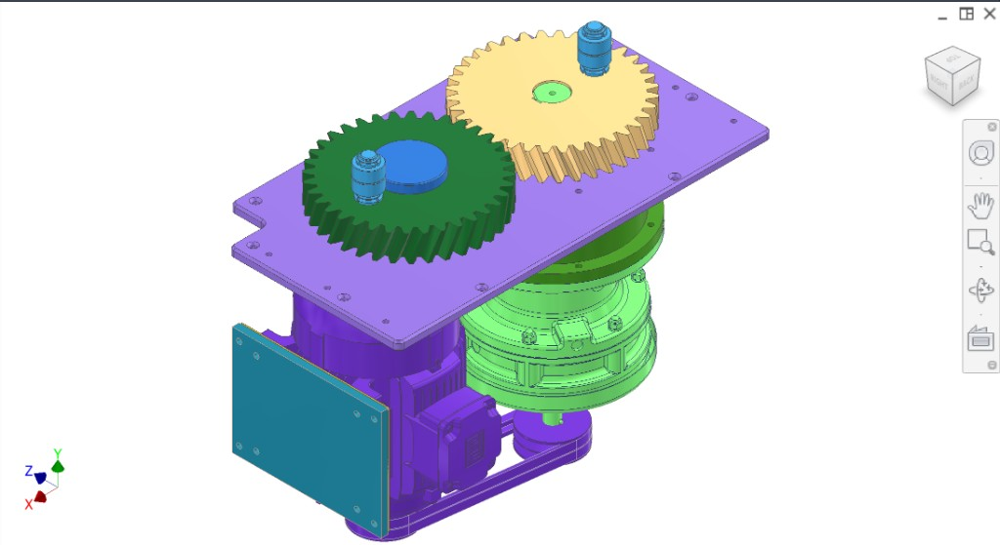  
*Figure 1. Isometric — gears, bearings, reducer, motor, V-belt.*

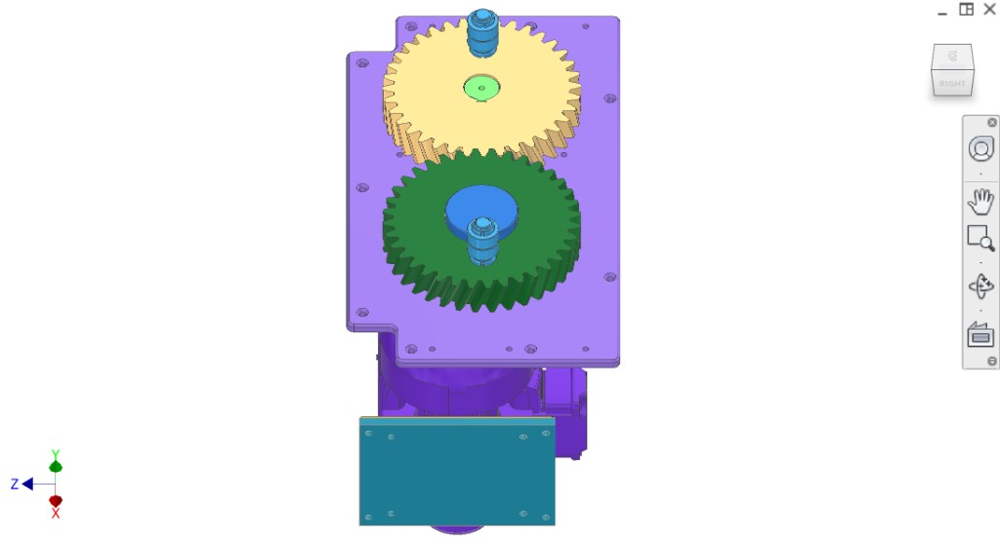  
*Figure 2. Top-down — two gears, reducer spacer, mounting.*

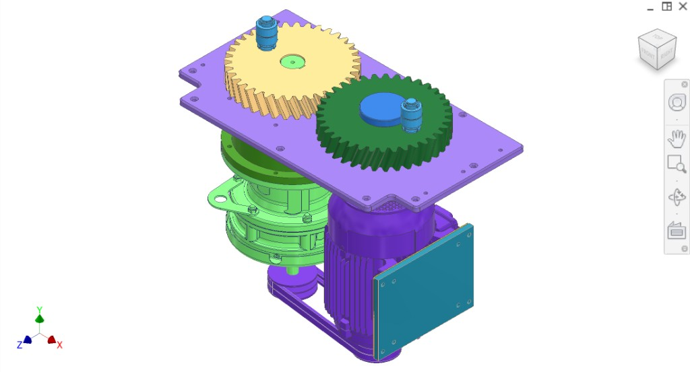  
*Figure 3. Elevated front-right — gear stack, reducer, motor, V-belt.*

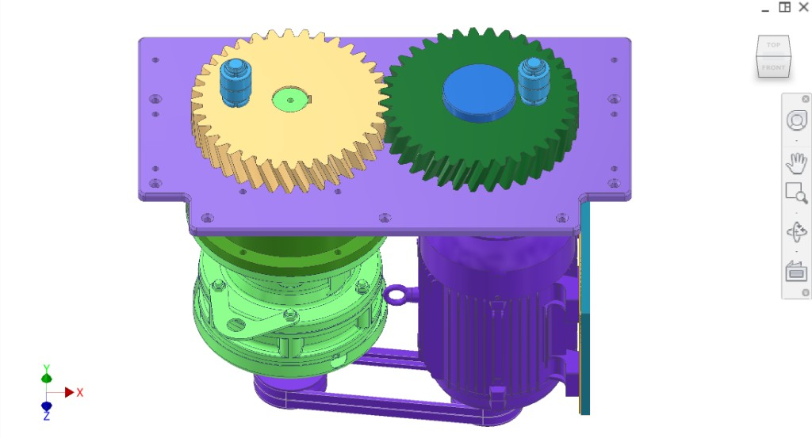  
*Figure 4. Front-right — mounting plate, gears, cam bearings, reducer, motor, spacers.*

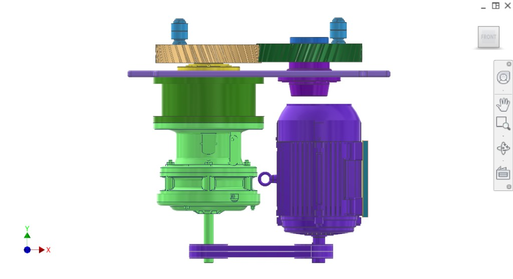  
*Figure 5. Front — motor, V-belt, reducer, gears, cam bearings.*

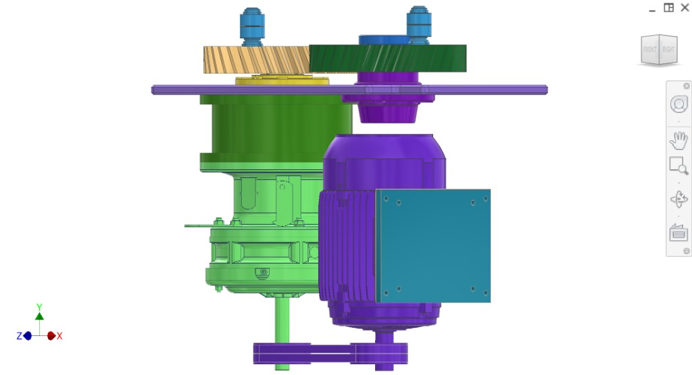  
*Figure 6. Right side — passive gear shaft, cam bearing, gears, motor, reducer.*

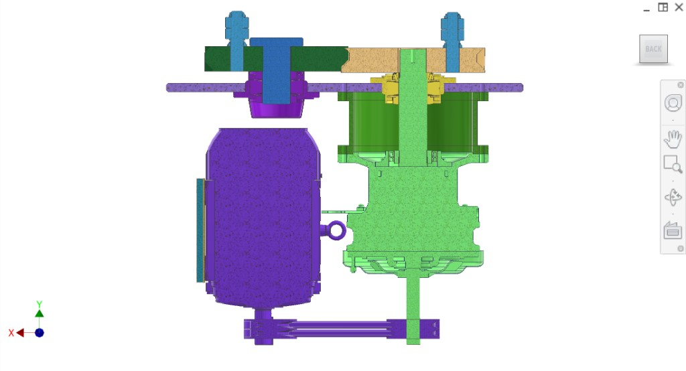  
*Figure 8. Front/side — gears, bearings, reducer, motor.*

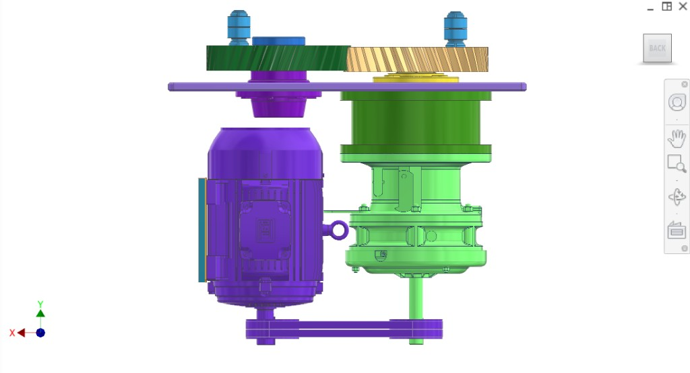  
*Figure 9. Cross-section — yoke, cam bearings, mount plates, gears, reducer, motor, V-belt.*

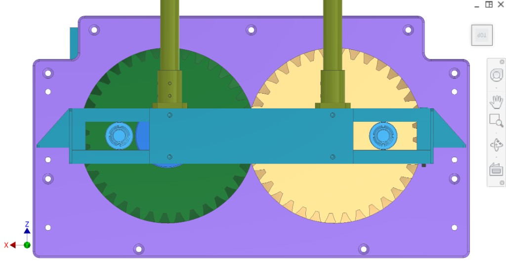  
*Figure 11. Back — motor, reducer, V-belt, mounting.*

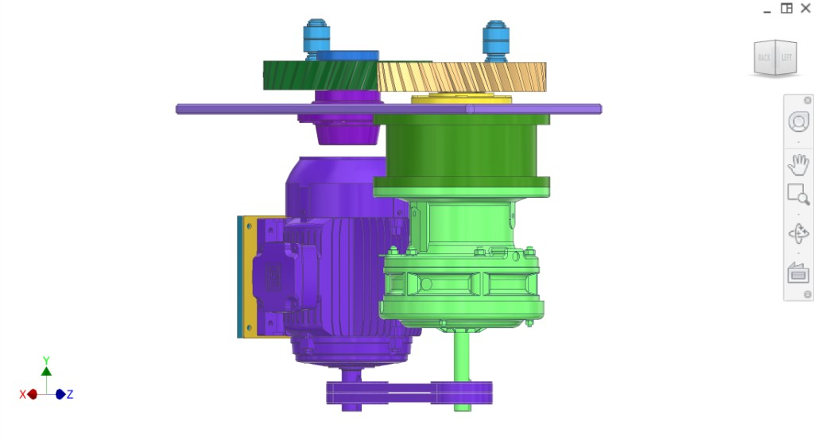  
*Figure 12. Front — full assembly.*

**Cam bearings / yoke interface (2 views):**

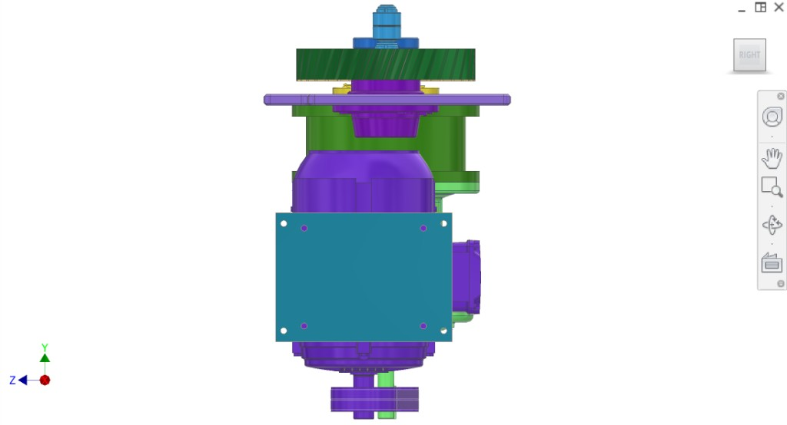  
*Figure 7. Cam bearings interfacing with transmission subsystem yoke.*

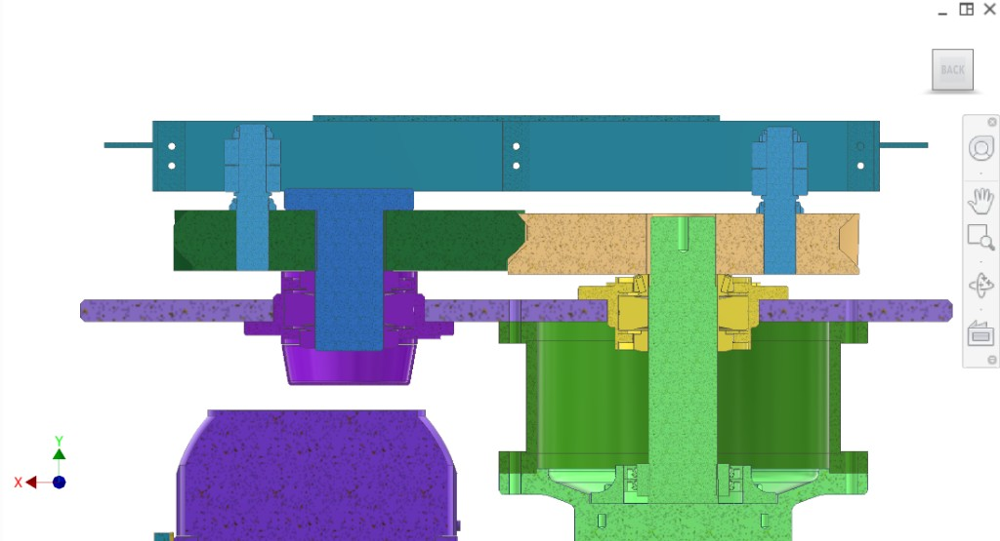  
*Figure 10. Top — two gears meshing, yoke (#2F9EBA), cam bearings in yoke.*

## Interfaces

- **Input:** Motor (WEG 22 1450 rpm) via V-belt to Sumitomo Cyclo 6000 reducer.
- **Output:** Two cam bearings (#4AB6F6) interface with the [yoke](../Transmission/) of the transmission subsystem; reducer drives gear train → cam bearings → yoke motion.
- **Mount:** Drivetrain mount plate on main frame (see [Frame](../Frame/)).
