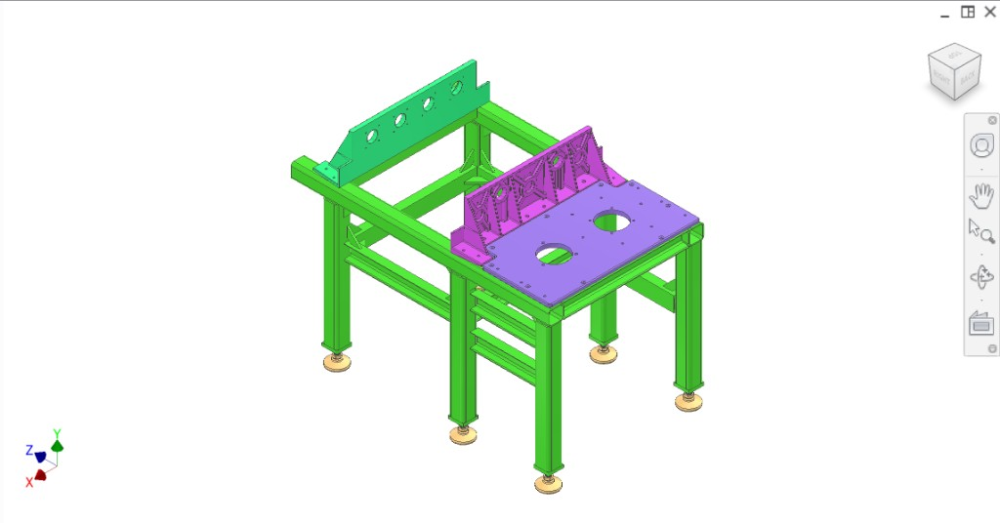
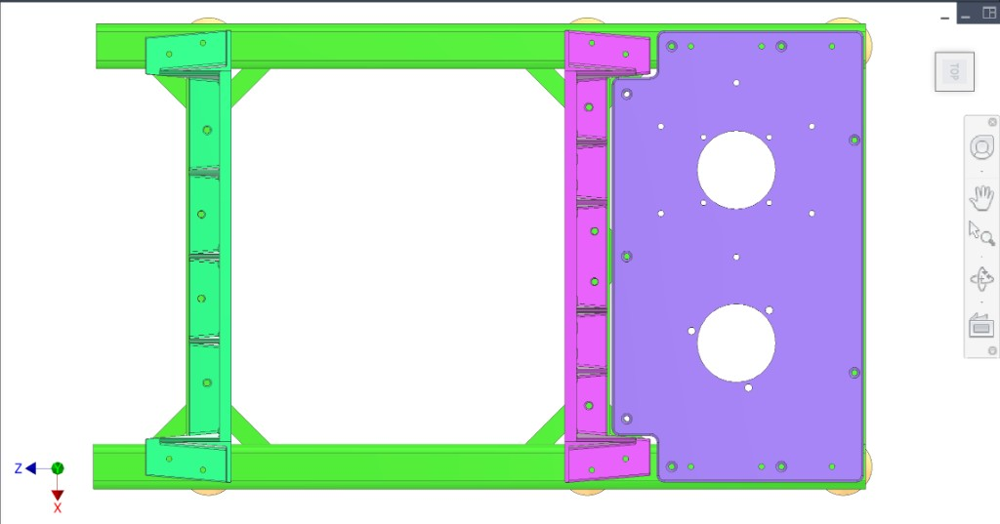
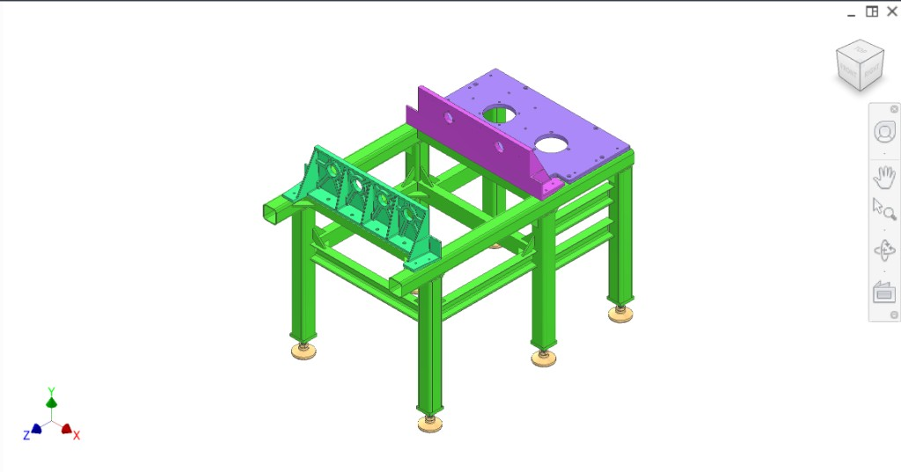
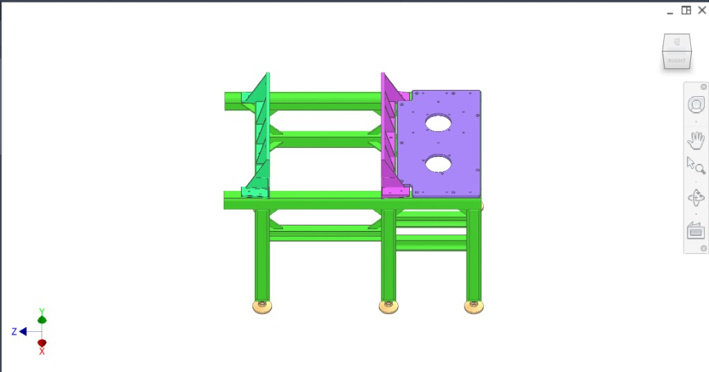
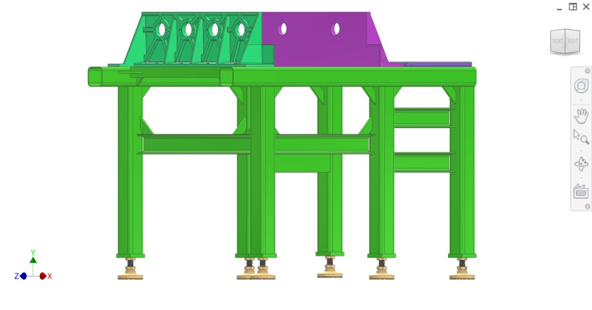
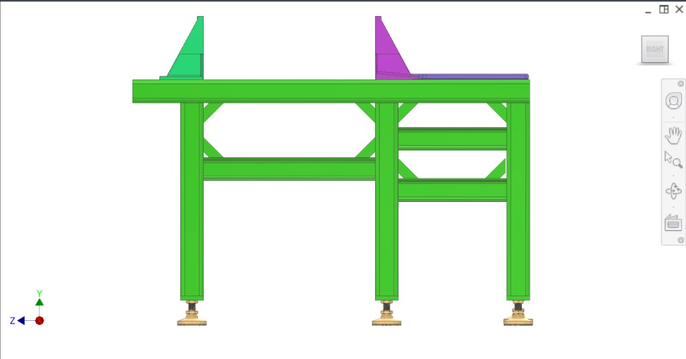
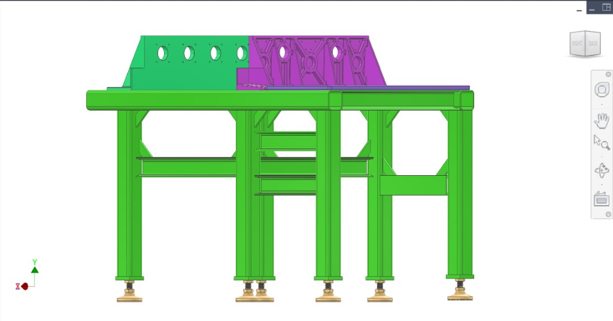

# 2.5 Frame subsystem

## Overview

The frame is the **primary structure** of the P6 machine (Delijuice 870/970). All other subsystems mount to it: the drivetrain, the plunger drive and juice collection, the intake/peelers, and the outflow and CIP hardware. The frame must provide a stable, repeatable base so that:

- **Drivetrain** forces are carried into the structure without deflection that would affect timing or bearing life.
- **Linear bearing** mounts stay aligned so the two drive shafts run true and the yoke travels smoothly.
- **Peelers** (on the loaded mount plate) stay fixed in position for extraction and CIP.

The frame is a welded structure with three main loaded interfaces (plates/brackets) that must be mounted and dismounted repeatedly during build and service; repeatable alignment is achieved with dowels and H7 drill/ream holes in the side rails.

**Key interfaces:** Main frame → **drivetrain mount plate** (gears, reducer); main frame → **transmission mount plate** (yoke, two 35 mm shafts, two LMK35UU linear bearings — the *transmission subsystem*); main frame → **loaded mount plate** (collection assembly, static side of extraction). The transmission mount plate was previously called the bearing mount plate. All three plates are mounted from the top onto the frame and installed onto the two side rails. Enclosure/shell (if used) is separate; see Enclosure-shell.

### Design principles

These principles guide frame design and any changes to the current configuration:

| Principle | Description |
|-----------|-------------|
| **Stability** | The frame shall resist deflection under operating loads (drivetrain, plunger, peelers) so that alignment and timing are maintained. Stiffness of the welded structure and of the three plate interfaces is critical. |
| **Alignment** | All mounted subsystems depend on accurate, repeatable positioning. The three main interfaces (drivetrain mount plate, transmission mount plate, loaded mount plate) shall be located and oriented so that drive shafts, bearings, and peelers align to design intent. Dowels and H7 holes provide repeatable alignment after disassembly. |
| **Force transmission** | Reaction forces from the drivetrain and plunger shall be carried through the frame into the floor without local distortion that would affect bearing life or peeler position. Load paths shall be clear and joints adequate. |
| **Repeatability** | Plates and brackets shall be removable and remountable without loss of alignment. Drilled and reamed H7 holes in the side rails, plus dowels, define the datum; shims correct for fit-up. |
| **Serviceability** | The frame shall allow subassemblies (e.g. drivetrain, plates) to be removed and reinstalled for maintenance. No permanent reliance on “fit once” alignment. |
| **Manufacturability** | Materials (80×80×5 GB/T tube, #8 C-brackets), weldability, and assembly sequence (level → mount → drill/ream → disassemble → build subassemblies → reassemble) shall be achievable by the fabrication partner (e.g. Sean/YES). |

### Figure key (CAD colour coding)

| Colour (hex) | Component |
|-------------|-----------|
| #26C16A | Main frame |
| #34E682 | Loaded mount plate (collection assembly; static side of extraction) |
| #B341C3 | Transmission mount plate (transmission subsystem: yoke, two 35 mm shafts, two LMK35UU linear bearings) |
| #9075CD | Drivetrain mount plate (gears, housed tapered roller bearings, reducer spacer, Sumitomo reducer) |
| #FFD691 | 6111K669 M24 100 mm Swivel Leveling Mount (McMaster), on M24 tapped endplates at bottom of legs |

### Overview figures

  
*Figure 1. Isometric — main frame (#26C16A), three interface plates, leveling mounts (#FFD691).*

  
*Figure 2. Top-down — three loaded interfaces on side rails: loaded mount plate (#34E682), transmission mount plate (#B341C3), drivetrain mount plate (#9075CD).*

  
*Figure 3. Isometric alternate view.*

  
*Figure 4. Perspective view.*

  
*Figure 5. Front/angled — six legs, six leveling mounts; loaded plate (left), transmission plate (right).*

  
*Figure 6. Right side — frame, leveling mounts, loaded plate (left), transmission plate (right).*

  
*Figure 7. Side — all three plates: loaded (left), transmission (centre), drivetrain (right); six feet.*

---

## Main frame construction

The main frame of the machine is made up of 80×80×5 GB/T square tubes, which act as the main load-bearing components. The other supporting members are formed using #8 C-brackets. All the frame members are fully welded together to ensure structural integrity.

To maintain a flat top surface on the frame that can accommodate the repeated mounting of three main loaded parts, adjustable height feet are included. The frame uses **6111K669 M24 100 mm Swivel Leveling Mounts** (McMaster), screwed into **M24 tapped endplates** on the bottom of the frame legs (six legs in the current design). The feet allow the entire frame body to be level on the ground.

Side rails in the frame have square holes that allow dowels to be inserted. Bolts and nuts screw the bodies to the cross beams and remaining components.

## Assembly steps

The steps for assembling the frame are:

1. Adjust the frame to be flat by increasing the height of the six feet.
2. Mount the plates to the frame and add shims where needed to ensure plates and brackets are flush to the frame.
3. Use bolts to fasten the plate to the frame.
4. Drill and ream H7 holes through the three plates and into the side rails. These holes are used to align the plates repeatedly against the frame.
5. The bolts can now be unfastened, and the subassemblies can be made before being reassembled onto the frame using the previously drilled holes as a reference.