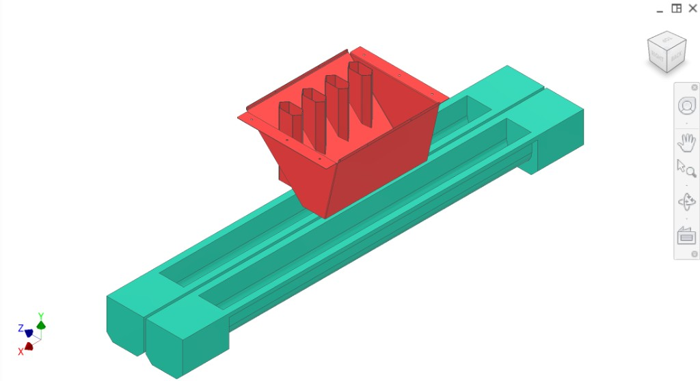
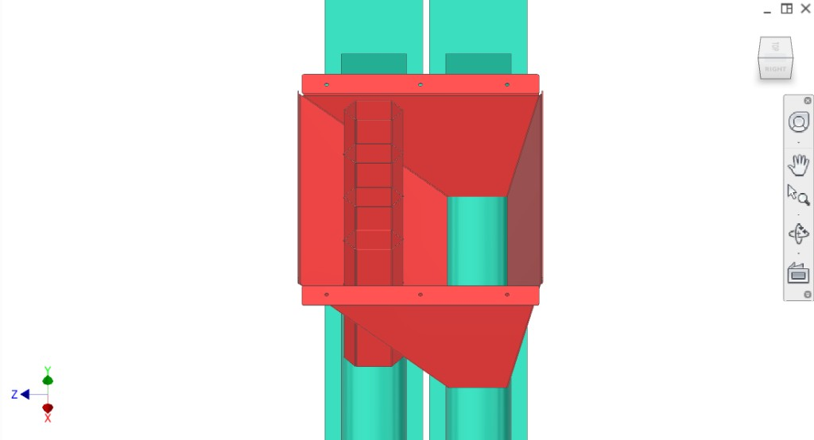
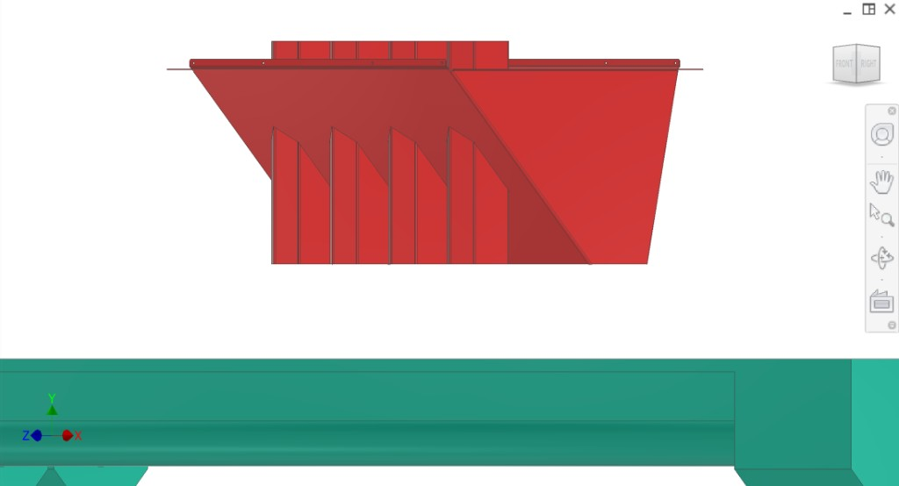
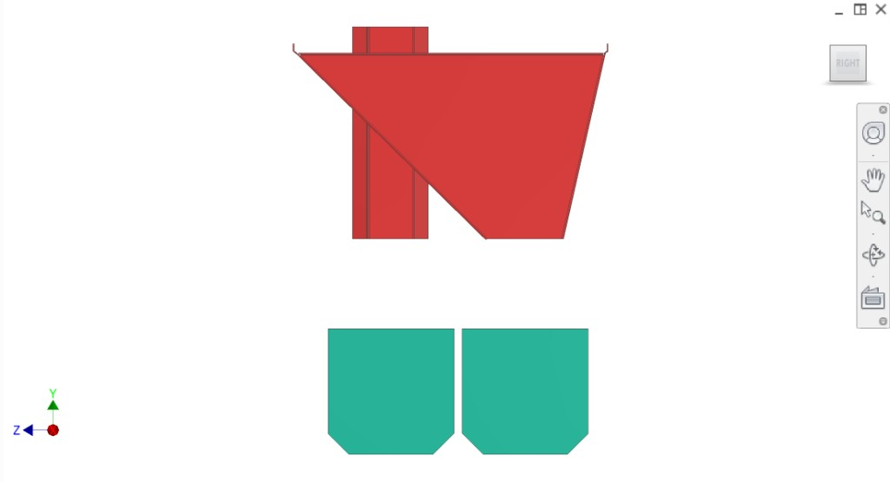
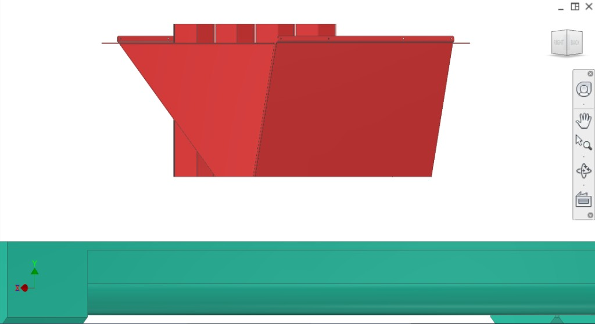
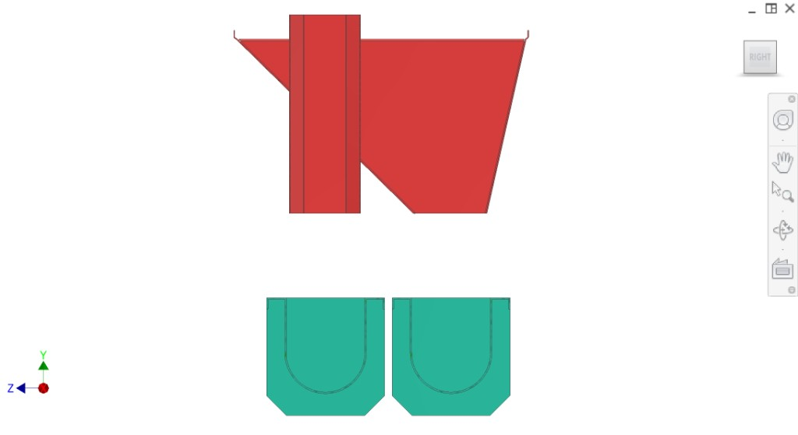
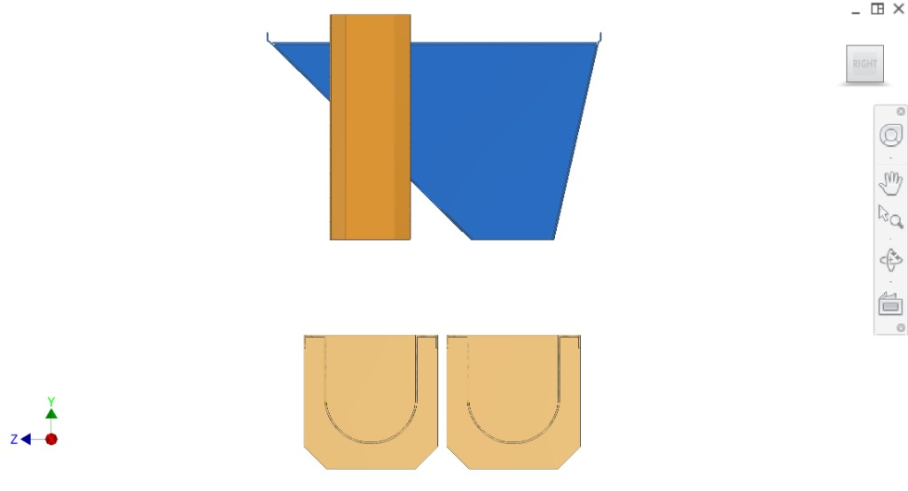
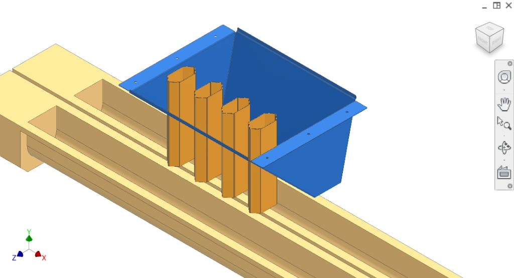
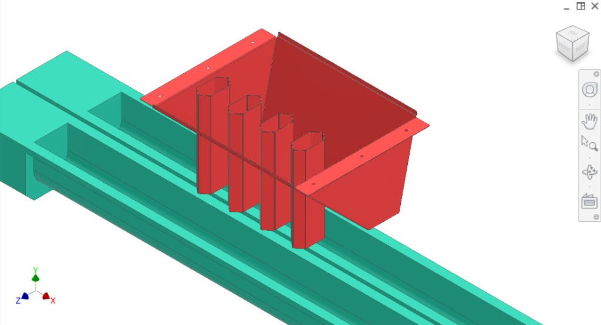

# 2.4 Outflow / disposal subsystem

The **disposal system** separates and conveys **peels** and **plugs/cores** from the extraction/collection area. It consists of the **peel chute** (red #D43C3C), **core chutes** (welded to the peel chute), and **two augers** (teal #28B399) that take peels and plugs/cores away separately.

## Function (extraction cycle context)

1. **Pressing stroke** (extraction cycle): Juice leaves the oranges into the branched Y-section of the collector (see [Collection](../Collection/)).

2. **Plug ejection:** The **plug ejection system** pushes a **plunger** through the **filter**, pushes the **plug** back out of the **plug cutter**, and the plug **falls into the core chute** (see [Plug-ejection](../Plug-ejection/)).

3. **Peels:** Meanwhile, **peels** fall to the **sides of the peelers** and **avoid the core chutes**, **separating into two channels** for separate processing.

4. **Augers:** The **two augers** receive the separated streams and **take the peels and the plugs/cores away separately**.

## Components (CAD colour key)

| Colour (hex) | Component |
|--------------|-----------|
| **#D43C3C** | **Peel chute** — red; folded sheet metal component; collects peels from sides of peelers |
| (welded to above) | **Core chutes** — welded to the peel chute; plugs/cores fall here after plug ejection |
| **#28B399** | **Two augers** — teal; take peels and plugs/cores away separately |

### Alternative colour scheme (some CAD views)

| Hex | Component |
|-----|-----------|
| #2768BC | Peel chute (blue) |
| #D79132 | Core chutes (orange-brown) |
| #FFED9E | Two augers (light yellow) |

## Construction

- **Peel chute:** Folded sheet metal component.
- **Core chutes:** Welded to the peel chute; positioned so plugs from the plug cutter fall into them; peels fall to the sides and avoid the core chutes, separating into two channels.

## Overview figures

  
*Figure 1. Top-down isometric — red chute on teal base, two parallel channels.*

  
*Figure 2. Red peel chute with core chutes; two teal augers.*

  
*Figure 3. Red chute only, above frame.*

  
*Figure 4. Right view — red chute, core chutes, teal augers below.*

  
*Figure 5. Front — red folded sheet metal chute above teal frame.*

  
*Figure 6. Right — red chute; two teal U-shaped auger housings.*

  
*Figure 7. Alternative colours — blue peel chute, orange core chutes.*

  
*Figure 8. Alternative — blue chute, orange core chutes, channels.*

  
*Figure 9. Red chute with four hexagonal core chutes above teal auger channels.*

## Interfaces

- **Input (plugs):** From [plug ejection](../Plug-ejection/) — plunger pushes plug out of plug cutter → plug falls into core chute.
- **Input (peels):** From [collection](../Collection/) / extraction — peels fall to sides of peelers, avoid core chutes, into peel chute; two channels.
- **Output:** Two augers convey peels and plugs/cores away separately for further processing.
