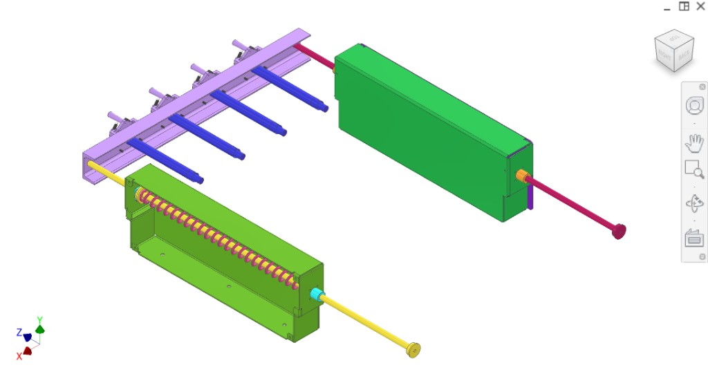
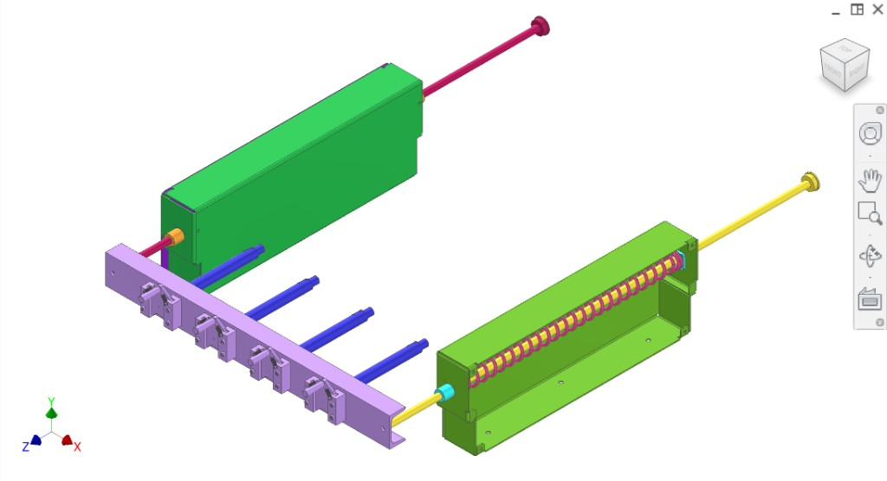
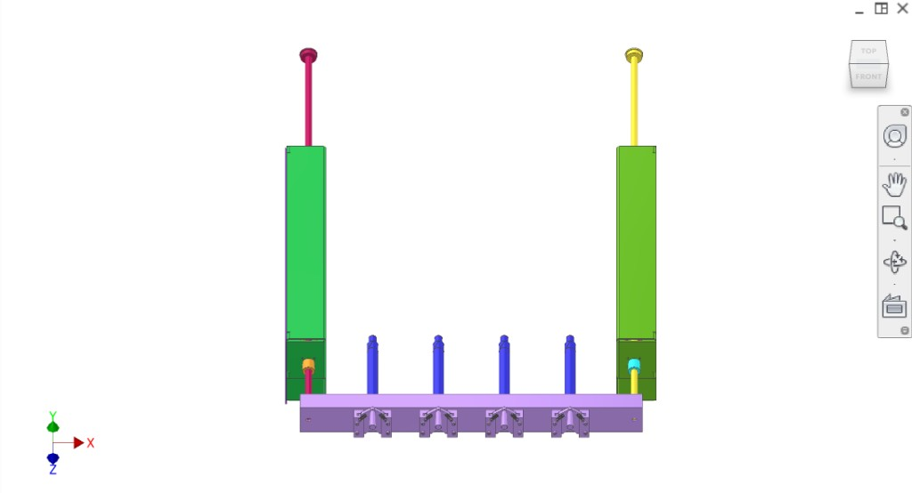
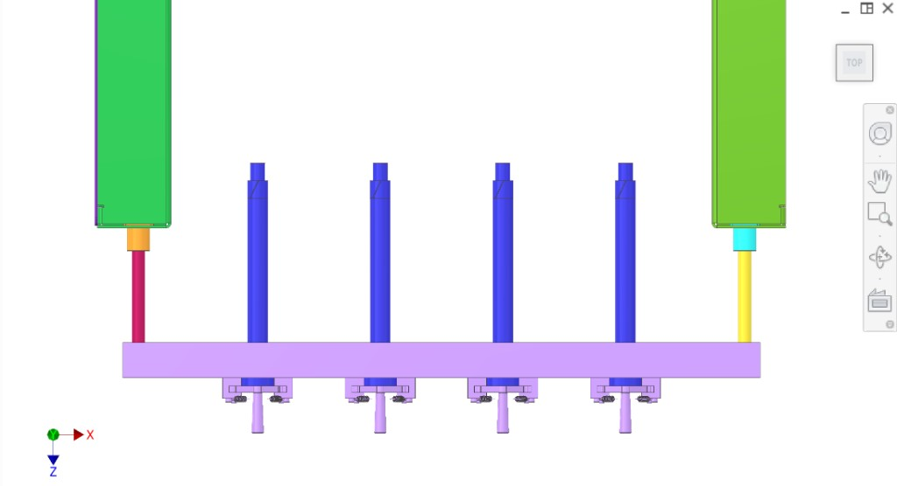
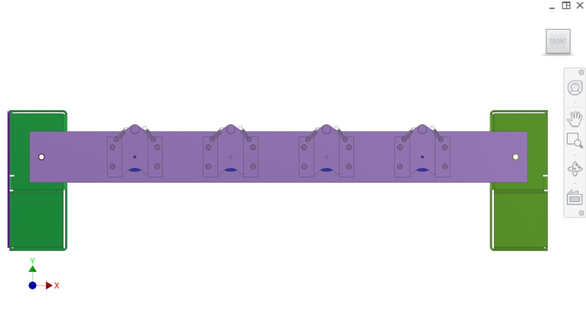
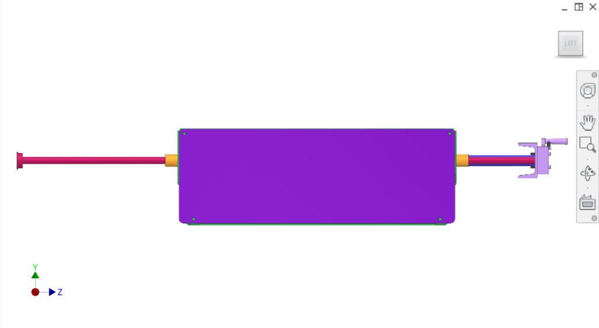
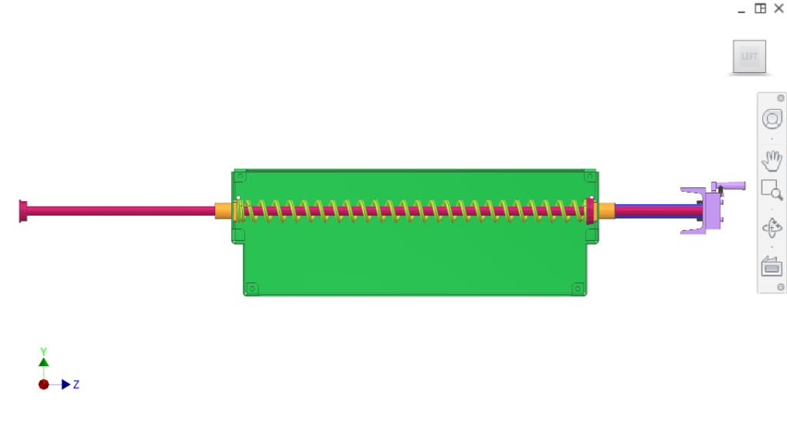

# 2.2 Plug ejection (plunger / juice collection)

The **plug ejection system** is part of the plunger drive / juice collection subsystem. It ejects the cylindrical **plug** (cut from the centre of oranges by the [plug cutter](../Collection/) in the collection subsystem) after the pressing stroke, so the plug falls into the [disposal](../Outflow-disposal/) core chute.

## Function (extraction cycle)

1. **Pressing stroke:** During extraction, juice leaves the oranges into the branched Y-section of the [collector](../Collection/). The plug remains in the plug cutter / filter area.

2. **Plug ejection:** After the pressing stroke, the **plug ejection system** pushes a **plunger** through the **filter**, pushes the **plug** back out of the **plug cutter**, and the plug **falls into the core chute** of the [disposal system](../Outflow-disposal/).

3. **Disposal:** Meanwhile, peels fall to the sides of the peelers, avoid the core chutes, and separate into two channels; the two augers take peels and plugs/cores away separately (see [Outflow-disposal](../Outflow-disposal/)).

## Components (from RFP context)

- **Plunger** — pushes through filter to eject plug (multiple plungers in parallel)
- **Plunger actuator bar / plate** — light purple; carries plungers, moves in unison
- **Plug ejection channels/housings** — green; contain filter/plug-cutter interface; plugs exit to core chute
- **Actuator rods** — red, yellow — connect to drive mechanism
- **Guides/bushings** — orange, light blue — at housing interfaces
- **Return spring** — yellow helical spring in housing (return motion)
- **Filter** — juice through slots into collector; plunger passes through for plug ejection
- **Plug cutter** — (in [Collection](../Collection/)); plug cut during juicing, ejected by this system
- **Plunger drive bracket** — (drivetrain/plunger side)
- **Juice outflow collection** — (collection Y-tubes, filter, etc.)

## Overview figures

  
*Figure 1. Exploded — actuator bar, blue plungers, green housings, rods, spring.*

  
*Figure 2. Actuator plate, plungers into green housing; core chute side.*

  
*Figure 3. Front — vertical plungers, base, actuator mechanisms, green supports.*

  
*Figure 4. Plunger assemblies — purple plate, blue plungers, green blocks, connecting rods.*

  
*Figure 5. Top — structural bar, four plunger assemblies, green blocks.*

  
*Figure 6. Single station — plunger rod, yoke-like actuation, housing.*

  
*Figure 7. Left — plunger rod, green housing, spring, bushings, actuation.*

## Interfaces

- **Input:** Plug in plug cutter/filter after pressing stroke (from [Collection](../Collection/) extraction).
- **Output:** Plug ejected → falls into [disposal](../Outflow-disposal/) core chute.
- **Mechanical:** Plunger driven by plunger drive (see [Drivetrain](../Drivetrain/) / [Transmission](../Transmission/) context as needed).
