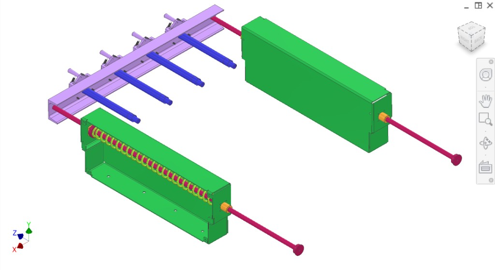
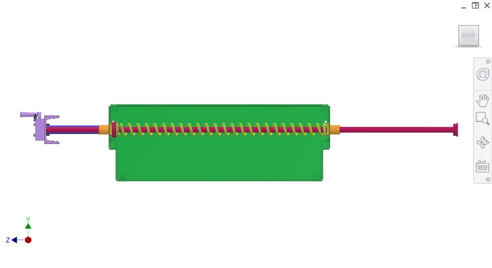
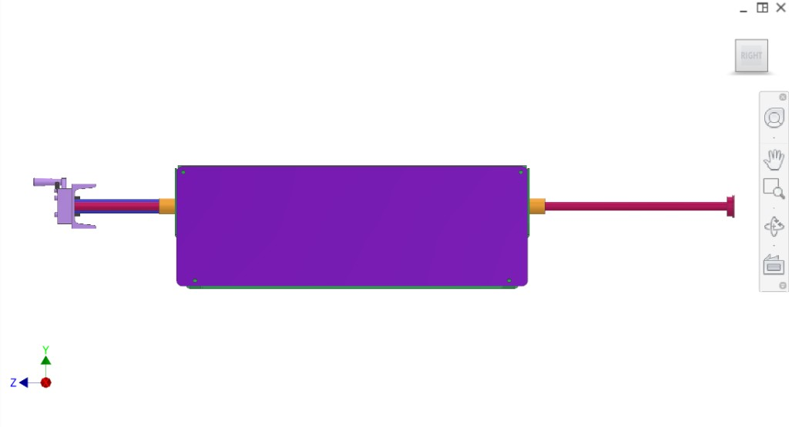
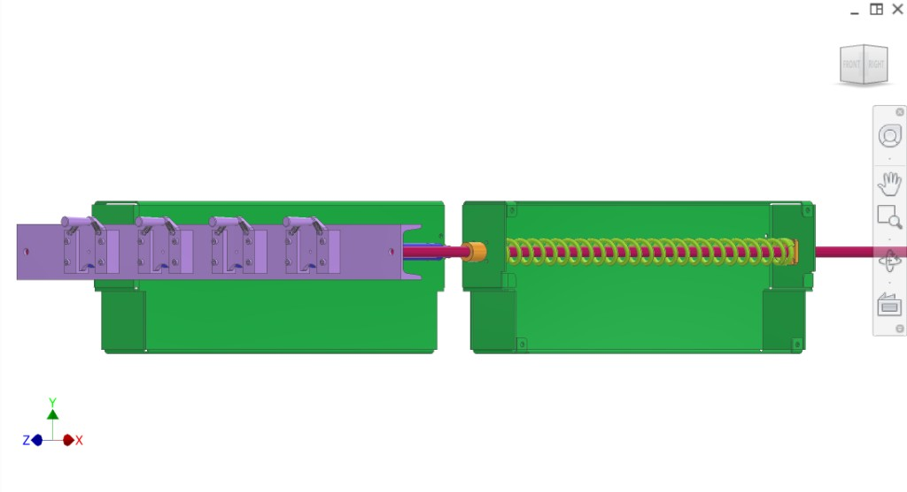
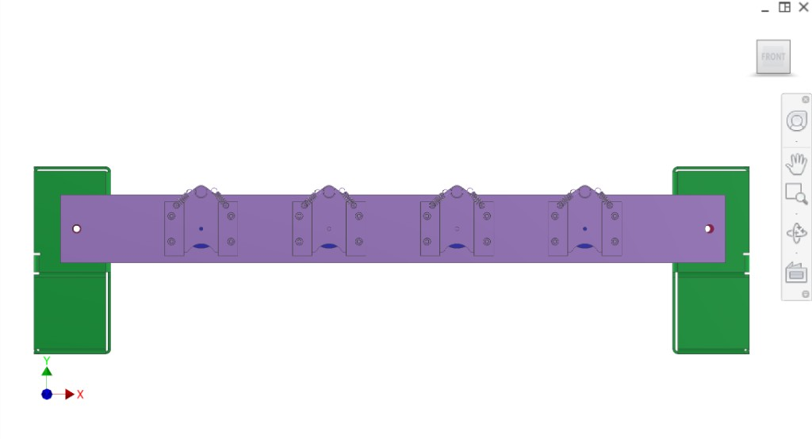
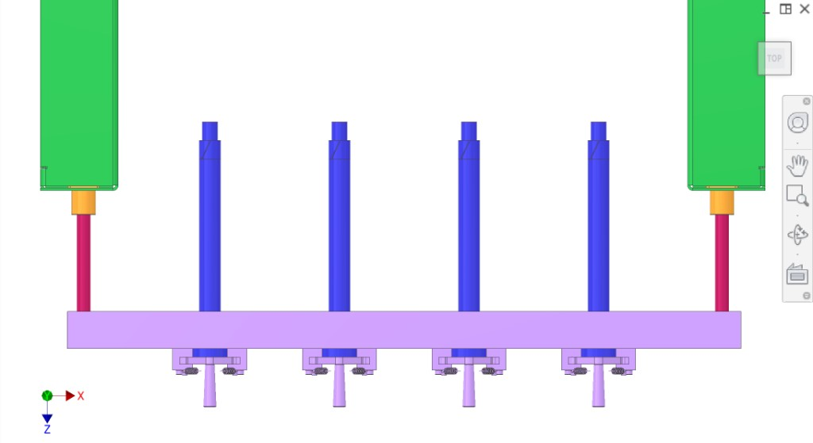

# 2.2 Plug ejection (plunger / juice collection)

The **plug ejection system** is part of the plunger drive / juice collection subsystem. It ejects the cylindrical **plug** (cut from the centre of oranges by the [plug cutter](../Collection/) in the collection subsystem) after the pressing stroke, so the plug falls into the [disposal](../Outflow-disposal/) core chute.

## Function (extraction cycle)

1. **Pressing stroke:** During extraction, juice leaves the oranges into the branched Y-section of the [collector](../Collection/). The plug remains in the plug cutter / filter area.

2. **Plug ejection:** After the pressing stroke, the **plug ejection system** pushes a **plunger** through the **filter**, pushes the **plug** back out of the **plug cutter**, and the plug **falls into the core chute** of the [disposal system](../Outflow-disposal/).

3. **Disposal:** Meanwhile, peels fall to the sides of the peelers, avoid the core chutes, and separate into two channels; the two augers take peels and plugs/cores away separately (see [Outflow-disposal](../Outflow-disposal/)).

## Components (CAD colour key)

| Colour (hex) | Component |
|--------------|-----------|
| #5151FA | **Plunger** — pushes through filter to eject plug (four in parallel) |
| #D1A4FF | **Plunger drive bracket** — C-channel; carries plungers, connects to plunger drive rods |
| #B31B5B | **Plunger drive rods** — linear actuation; pass through LMK16 bearings and into green housings |
| #EBA13D | **LMK16 linear bearing** — guides plunger drive rods at housing interfaces |
| #8CC135 | **Plunger drive spring** — helical; return force, coiled around rod in green housing |

Green rectangular housings enclose the spring and guide the rods; they interface with the filter/plug-cutter station and core chute.

- **Filter** — juice through slots into collector; plunger passes through for plug ejection
- **Plug cutter** — (in [Collection](../Collection/)); plug cut during juicing, ejected by this system

## Overview figures

  
*Figure 1. Exploded — plunger drive bracket, plungers, plunger drive rods, LMK16 linear bearing, plunger drive spring, green housings.*

  
*Figure 2. Right — green housing, plunger drive rod, plunger drive spring, plunger drive bracket, plunger, LMK16 bearings.*

  
*Figure 3. Orthogonal — central housing, plunger drive bracket, plunger, spring, plunger drive rods, LMK16 bearings (left and right).*

  
*Figure 4. Top — two green housings, plunger drive bracket with clamps, plunger drive rod, plunger, LMK16, plunger drive spring in right housing.*

  
*Figure 5. Front — plunger drive bracket, four sub-assemblies (V-bracket, plunger, rods, springs), green end blocks.*

  
*Figure 6. Front elevated — plunger drive bracket, four plungers, LMK16 at left/right, green housings, plunger drive rods.*

## Interfaces

- **Input:** Plug in plug cutter/filter after pressing stroke (from [Collection](../Collection/) extraction).
- **Output:** Plug ejected → falls into [disposal](../Outflow-disposal/) core chute.
- **Mechanical:** Plunger driven by plunger drive (see [Drivetrain](../Drivetrain/) / [Transmission](../Transmission/) context as needed).
