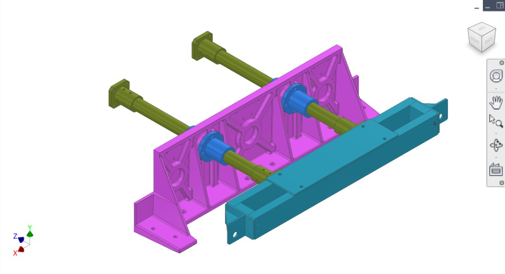
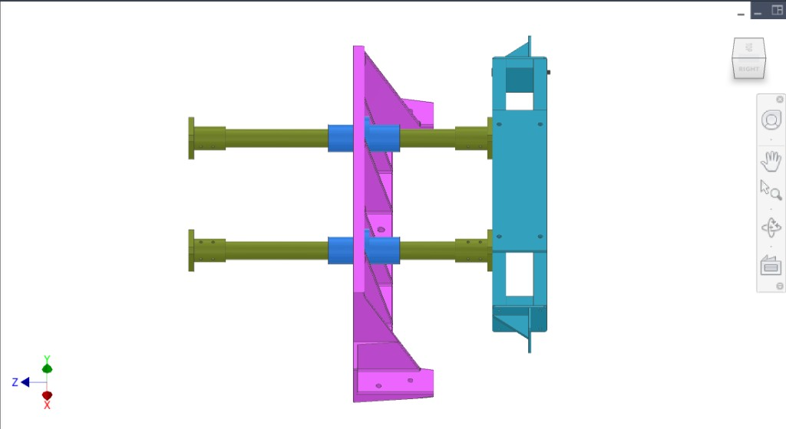
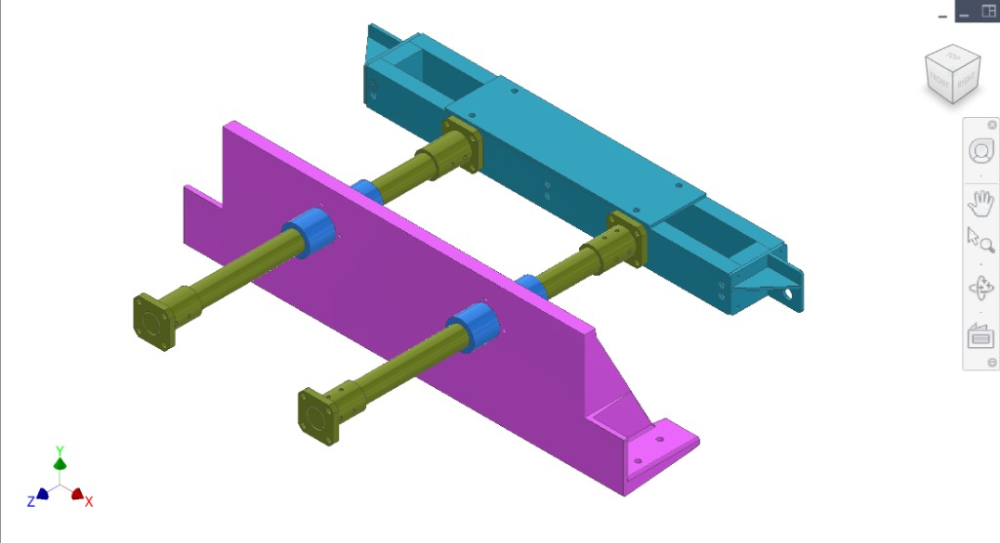
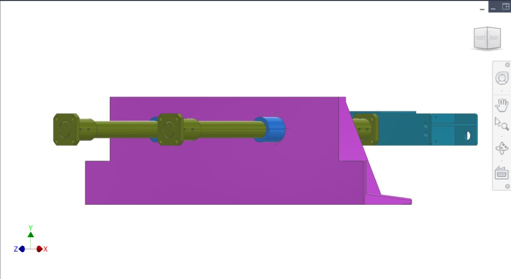
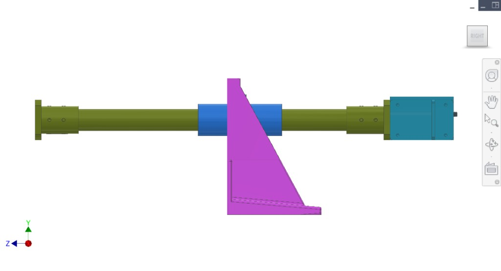
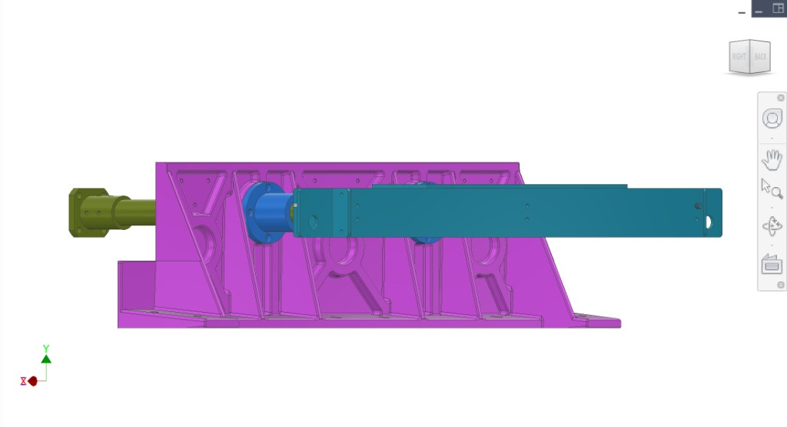
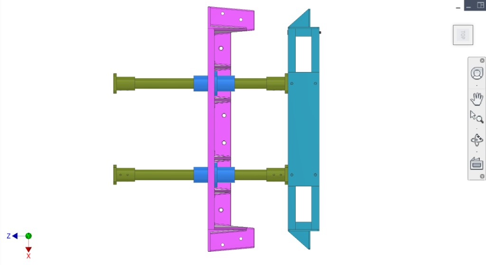

# Transmission subsystem

The **transmission system** comprises the yoke, two 35 mm drive shafts (with shaft mounts at both ends), two LMK35UU linear bearings, and the transmission mount plate. It is mounted on the main frame via the transmission mount plate (see [Frame](../Frame/)).

## Function

The transmission is responsible for **transmitting force from the gears** (drivetrain) **to the extraction/synchronisation system**. That system then **presses fruit against the collection system** mounted on the **collection system mount plate** (formerly the static mount plate / loaded mount plate).

Load path: **Gears (drivetrain)** → **transmission (yoke, shafts, bearings)** → **extraction/synchronisation** → fruit pressed against **collection system** on **collection system mount plate**.

## Components (CAD colour key)

| Colour (hex) | Component |
|--------------|-----------|
| **#2F9EBA** | **Yoke** — moving part; connected to the two drive shafts; transmits force to extraction/synchronisation |
| **#798C2E** | **Two drive shafts** with **shaft mounts** at both ends (35 mm shafts) |
| **#3582E4** | **Two LMK35UU linear bearings** — guide linear motion of the shafts through the transmission mount plate |
| **#B341C3** | **Transmission mount plate** — mounts to main frame; supports yoke, shafts, and bearings |

## Overview figures

  
*Figure 1. Transmission assembly: mount plate, yoke, two shafts, two LMK35UU linear bearings.*

  
*Figure 2. Side view — yoke, shafts, shaft mounts, linear bearings.*

  
*Figure 3. Isometric — transmission mount plate, yoke, drive shafts, bearings.*

  
*Figure 4. Side profile — plate, shafts, bearings, yoke.*

  
*Figure 5. Right-side view.*

  
*Figure 6. Side — yoke, shafts, bearings on transmission mount plate.*

  
*Figure 7. Top/slightly isometric — yoke, shafts, bearings; collection system mount plate in view.*

## Interfaces

- **Input:** Force from gears (drivetrain) on drivetrain mount plate.
- **Output:** Linear motion of yoke → extraction/synchronisation system → fruit pressed against collection system.
- **Mount:** Transmission mount plate (#B341C3) bolts to main frame (see Frame subsystem). Collection system is on the collection system mount plate (loaded mount plate, #34E682).
